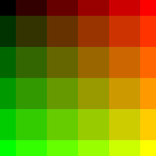
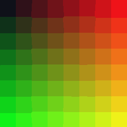

# stumpy_gif

__This is alpha software, it might not work at all or eat up tons of memory__

## Interface

* `StumpyGIF.write(frames : Array(Canvas), path)` saves a list of frames (canvasses) as a GIF image file
* `StumpyGIF::GIF`, helper class to store some state while parsing GIF files
* `Canvas` and `RGBA` from [stumpy_core](https://github.com/l3kn/stumpy_core)

## Usage

### Writing

``` crystal
require "stumpy_gif"

frames = [] of StumpyCore::Canvas

(0..5).each do |z|
  canvas = StumpyCore::Canvas.new(256, 256)

  (0..255).each do |x|
    (0..255).each do |y|
      color = StumpyCore::RGBA.from_rgb_n([x, y, z * 51], 8)
      canvas[x, y] = color
    end
  end

  frames << canvas
end

StumpyGIF.write(frames, "rainbow.gif")
```


Websafe color quantization


Median split color quantization

(See `examples/` for more examples)

## Color Quantization Methods

* Use Websafe colors
* Median Split
* NeuQuant

## References

* [Kohonen Neural Networks for Optimal Colour Quantization](http://members.ozemail.com.au/~dekker/NeuQuant.pdf)
